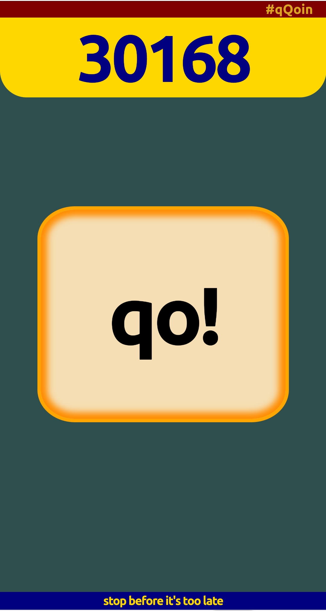

# qQoin

toy project, not for production use (you have been warned)

## TG mini app

* back/ -- backend API (go)
* webapp/ -- frontend (js, html, css, …)

### @qqoin_bot

## qQoken (qQoin NFT token)

* qqoken/ -- smart contracts (FunC, TON), deploy scripts (js, bash)

### qQollection

[tonviewer.com/EQA4mmOGIO_hH-z286PtdLQoBS2MoUp4QivzcfvTxRHWcszX](https://tonviewer.com/EQA4mmOGIO_hH-z286PtdLQoBS2MoUp4QivzcfvTxRHWcszX?section=overview):

